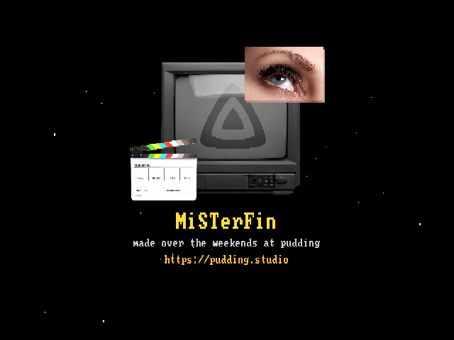

# MiSTerFin

<p align="center"></p>

A [Jellyfin](https://jellyfin.org) client for the [MiSTer FPGA](https://misterfpga.org) platform. Browse your Movies/TV/Music library, see cover art and overview, and play back on a CRT — video is server-side transcoded and letterboxed to PAL or NTSC, with client-side subtitles, full pause/seek/resume support, and a proper music player with a now-playing screen. Works with whatever analog output your MiSTer is already set up for (SCART, composite, component, ...) — MiSTerFin just writes to the standard framebuffer, same as any other MiSTer app.

---

## Features

- **Home screen** is a horizontal library carousel — name + item count per library, the active one centered, with a dimmed cover-art mosaic from that library filling the background. Every library gets its own slot along the strip (extras simply run off-screen rather than being hidden), and LEFT/RIGHT slides between them with the background fading through black. SELECT swaps to a classic list view instead, if you prefer that; either way, the selected library is remembered when you back out of one. B opens an exit-confirm dialog instead of quitting immediately, so a stray press can't silently close the app
- **Browsing within a library** (movies/series/albums/episodes/tracks) uses a list with cover art per item, watched/resume badges, a live clock, and a scrolling marquee for titles too long to fit (e.g. "Artist / Album", "Series / Season"). Albums show year + track count, artists show album count, and series show season + episode count
- **Info screen** with cover art, description, year, and status
- **Video playback** is server-side transcoded with correct letterbox/pillarbox scaling for any source aspect ratio
- **Pause menu** with a live progress bar, VSync ON/OFF toggle, resume/stop
- **Subtitles** are rendered client-side (instant toggle/switch, no re-buffering) for text-based tracks, with a picker menu and live sync fine-tuning; image-based tracks (PGS/VobSub — no text to hand back client-side) fall back to a server-side burn-in automatically instead of silently failing to show
- **Music library**: browse Artists → Albums → Tracks, direct-play audio (no server transcode needed for a plain FLAC/MP3 file), a now-playing screen with a live clock, cover art (falls back to the album's cover for a track with no embedded art of its own), a real audio-reactive VU meter pair (reads mplayer's own live PCM export, not a decorative animation), a SELECT-cycled background effect — starfield, rain, or a faithful port of [MiSTer-Toasty-Squadron](https://github.com/puddingstudio/MiSTer-Toasty-Squadron)'s own flying-toaster screensaver (same flight paths, sizes, and moon, right down to its biggest sprites flying over the cover art) — seek within a track, and prev/next-track navigation that auto-advances at the end of each track
- **Sync**: resume position and watched status are read from and reported back to Jellyfin, so they stay in sync with your other Jellyfin clients
- **About screen** with a GitHub-releases update check; the same animated starfield background also shows on the setup screen if `jellyfin.conf` is missing/misconfigured

## Scope (v1)

- Movies, TV shows, and Music — no photo libraries
- Server-side transcode for video (the MiSTer's ARM Cortex-A9 can't decode arbitrary HEVC/4K sources locally) to a CRT-sized stream, then letterboxed/pillarboxed client-side to exactly fill the PAL/NTSC frame
- Audio plays back directly (`static=true`, no server transcode) — this mplayer build decodes FLAC/MP3 natively, and there's no letterboxing concern for audio the way there is for video

---

## Requirements

- MiSTer FPGA (standard Linux image, standard `menu.rbf` — no special core required)
- A reachable Jellyfin server + an API key
- `curl` on the MiSTer (included in the standard MiSTer Linux image)

There is no prebuilt release yet — see **Building from Source** below. Everything needed to run MiSTerFin (including its own `mplayer-arm`) is built from this repo; you don't need a separate mplayer install or any other MiSTer app already set up.

Video output goes through the standard MiSTer framebuffer path (`mplayer -vo fbdev:/dev/fb0`) and works on any menu core.

---

## Building from Source

Requires [Zig](https://ziglang.org) (for ARM cross-compilation of the app itself) and [Docker](https://www.docker.com) (only for building `mplayer-arm`, MiSTerFin's own fbdev-patched mplayer — a one-time step, not needed again unless you want to rebuild it).

```bash
# 1. Build mplayer-arm (one-time; needs Docker)
cd docker
docker build -t misterfin-mplayer .
docker run --name misterfin-mplayer-build misterfin-mplayer
docker cp misterfin-mplayer-build:/build/mplayer-arm ../mplayer-arm
docker rm misterfin-mplayer-build
cd ..

# 2. Build the app itself
make arm

# 3. Deploy everything over SSH (uses the standard MiSTer root password)
make deploy
```

`make deploy` copies `misterfin-arm`, `mplayer-arm`, `assets/font/`, `assets/subfont/`, `assets/toasty/`, `assets/about.png`, and the launcher script to the right places on the MiSTer — see the `deploy` target in `Makefile` if you want to do it manually instead.

`make deploy` targets `mister.local` by default. This works as-is if your MiSTer is visible under that hostname on your network (its stock image advertises itself via mDNS) and you haven't changed the default `root` login. If `mister.local` doesn't resolve for you, override it with your MiSTer's IP instead: `make deploy MISTER_HOST=192.168.x.x`.

If you'd rather not build `mplayer-arm` yourself, MPlayer 1.5 built with `--enable-fbdev --enable-alsa` and the vsync patch in `docker/vo_fbdev.c` applied will work — that's exactly what `docker/build-mplayer.sh` automates.

---

## Installation

1. Copy these files to `/media/fat/misterfin/` on your MiSTer:

   ```
   misterfin-arm
   mplayer-arm
   font/
   subfont/
   toasty/
   about.png
   jellyfin.conf      (see below)
   ```

2. Copy the launcher script:

   ```
   tools/MiSTerFin.sh  →  /media/fat/Scripts/MiSTerFin.sh
   ```

3. Launch from the MiSTer **Scripts** menu.

(`make deploy` does steps 1–2 for you, minus `jellyfin.conf` itself.)

---

## Configuring `jellyfin.conf`

Create `/media/fat/misterfin/jellyfin.conf` — 4 lines (see `jellyfin.conf.example`):

```
http://192.168.2.10:8096
your-api-key-here
your-username-here
PAL
```

1. **Server URL** — no trailing slash.
2. **API key** — Jellyfin admin dashboard → Advanced → API Keys → **+**.
3. **Username** — your plain Jellyfin username. MiSTerFin resolves it to the real user id via `GET /Users` at startup (the raw id isn't easily findable anywhere in the Jellyfin UI — it only shows up buried in a dashboard URL — but everyone already knows their own username).
4. **TV mode** — `PAL` or `NTSC`. Optional, defaults to `PAL`.

There is no on-screen setup keyboard in v1 — edit the file over SSH (using the standard MiSTer root password) or by pulling the SD card.

---

## Controls

### Browser
| Button | Keyboard | Action |
|--------|----------|--------|
| Left / Right | Left / Right | Navigate the home screen's library carousel |
| Up / Down | Up / Down | Navigate (home screen in list mode, or anywhere below it) |
| SELECT | Tab | Home screen only: swap between the carousel and the classic list |
| A | Enter | Open / drill in (library → series → season → episode, or library → artist → album → track) |
| B | Esc / Backspace | Back (opens an exit-confirm dialog from the top-level library screen — B cancels, A confirms) |
| START | Pause / Home | About screen |

### Info screen (movies/episodes)
| Button | Keyboard | Action |
|--------|----------|--------|
| A | Enter | Play (resumes automatically if a resume position exists) |
| SELECT | Tab | Restart from the beginning (only shown if a resume position exists) |
| B | Esc / Backspace | Back to browser |

### During video playback
| Button | Keyboard | Action |
|--------|----------|--------|
| A | Enter | Pause / resume |
| Left / Right | Left / Right | Seek back/forward 30s (or adjust subtitle sync, in the subtitle menu) |
| SELECT | Tab | Open the subtitle menu |
| L | PageUp | VSync ON |
| R | PageDown | VSync OFF |
| B | Esc / Backspace | Stop, back to browser |

### Subtitle menu (SELECT during video playback)
| Button | Keyboard | Action |
|--------|----------|--------|
| Up / Down | Up / Down | Select subtitle track (or off) |
| Left / Right | Left / Right | Adjust subtitle sync offset |
| A | Enter | Apply |
| B / SELECT | Esc / Backspace / Tab | Cancel |

VSync is ON by default (tear-free) — turn it OFF if you'd rather trade tearing for a bit more decode headroom.

### Now playing (music) — selecting a track plays it immediately, no separate info screen
| Button | Keyboard | Action |
|--------|----------|--------|
| A | Enter | Pause / resume |
| Left / Right | Left / Right | Seek back/forward 10s within the track |
| Up / Down | Up / Down | Previous / next track in the current album/list |
| SELECT | Tab | Cycle the background effect (starfield / rain / Toasty Squadron sprites) |
| B | Esc / Backspace | Stop, back to browser |

Reaching the end of a track auto-advances to the next one in the same list, same as any normal music player. Audio is direct-played, so seeking is a real in-place seek (no stop/restart the way video's seek needs).

A keyboard works standalone, with no gamepad attached.

---

## Known limitations

Verified against a real Jellyfin 10.11 server: auth, browsing (views/items, including Music), resume position, cover art, subtitles, video playback (transcoded over TS), and music playback (direct-played FLAC/MP3) all confirmed working end-to-end on real MiSTer hardware.

- **`playSessionId` is required on the video stream URL.** Without it, Jellyfin can silently serve back a stale cached transcode from an earlier request instead of honoring the current `maxWidth`/`maxHeight`/`videoBitRate` — confirmed on a real server. Already handled in `jf_stream_url()`.
- **Hardware-accelerated server transcoding (QSV/NVENC/VAAPI) may be broken on the user's server and is outside this client's control.** If `/Videos/{id}/stream` returns HTTP 500, check the Jellyfin server log (`/System/Logs`) for `FfmpegException` — if the ffmpeg command line shows `h264_qsv`/`h264_nvenc`/`vaapi`, the fix is server-side: Dashboard → Playback → Transcoding → Hardware acceleration → None (or fix the GPU driver).
- **No NEON-accelerated colorspace conversion in this mplayer/ffmpeg build.** Total pixel count (resolution) is what actually costs CPU, not bitrate — confirmed on hardware that doubling `videoBitRate` at a fixed resolution moved average CPU usage by only ~1 percentage point, while trying native PAL resolution (720x576) instead of the default 480x270 caused continuously growing A/V desync and pegged the CPU. Keep the transcode resolution small and spend bitrate freely on quality instead; let mplayer's own `-vf` scale it back up, which is cheap relative to decode.
- **mplayer's native MPEG-TS demuxer misses the video track** on Jellyfin's transcoded TS output — fixed by forcing `-demuxer lavf` in `play()`. If you ever see audio-only playback, this is the first thing to check.
- **Letterbox/pillarbox requires `dsize` as the last `-vf` stage, or mplayer overrides your sizing.** See the `-vf` chain in `play()` if you're touching this.
- **mplayer's `-af export` header fields (nch/sz) don't match this build's actual export file size** — the now-playing VU meter reads however many samples are actually present after the 8-byte header instead of trusting those fields. See `read_af_samples()` if you're touching the visualizer.
- **Any mplayer slave command sent while paused silently resumes playback unless prefixed with `pausing_keep`.** This isn't Jellyfin/MiSTerFin-specific, just an mplayer slave-mode quirk — but it's the reason pause-state commands (subtitle visibility, seeking while paused) are all prefixed that way throughout `main.c`.
- **Server-side subtitle burn-in (image-based tracks only) forces a full stream restart, and seeking with it active re-decodes from the true start of the file up to the seek target** — a multi-minute stall on a deep seek. Text-based tracks are unaffected (rendered client-side, no restart). See `jf_stream_url()`'s `burn_in_sub_index` comment.
- **`MediaSourceId` is omitted** from stream/progress/subtitle requests rather than guessed — works for direct single-version items; multi-version items (multiple cuts/qualities of the same title) may not resolve to the version you expect.
- **No on-screen keyboard** for server setup — `jellyfin.conf` must be edited manually (SSH or SD card).
- Silent failure if `mplayer-arm` can't open the stream (bad URL, server down, transcode rejected) — you're dropped back to the browser with no error message.

---

## Licence

[CC BY-NC 4.0](https://creativecommons.org/licenses/by-nc/4.0/) — free to use, share, and modify, non-commercial only.

---

| <a href="https://pudding.studio"></a> | *made over the weekends at pudding*<br>https://pudding.studio |
|:---:|:---|
