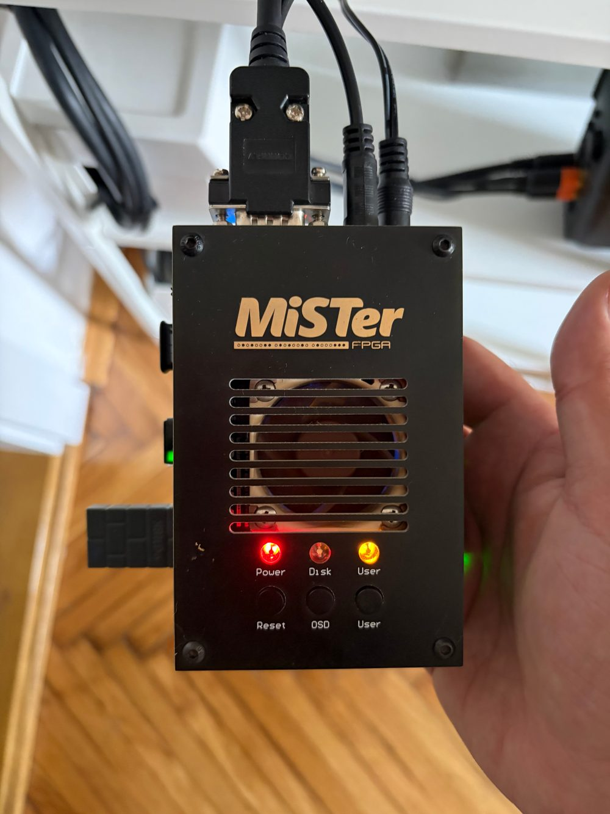
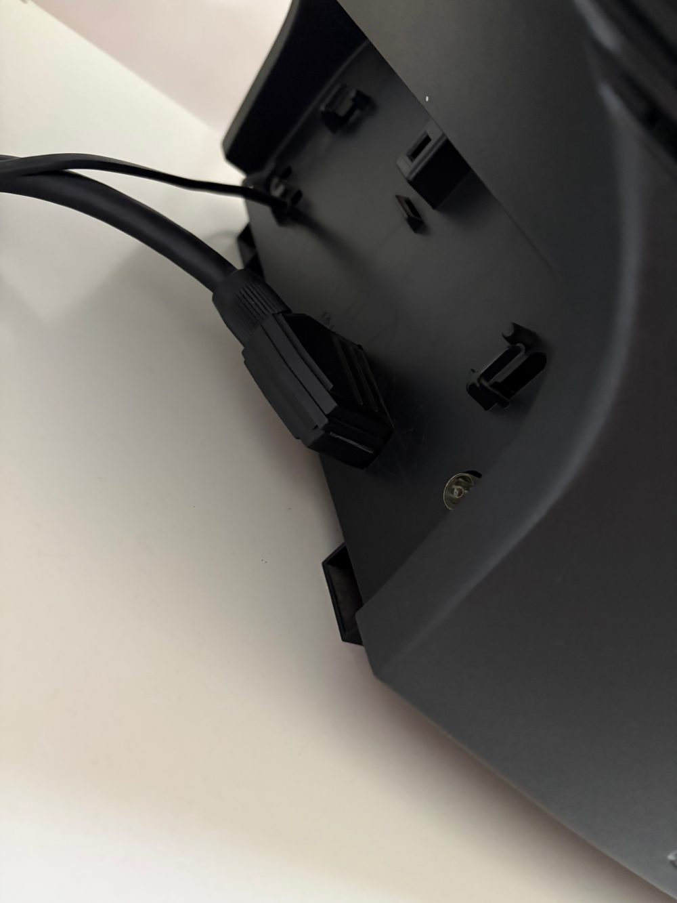
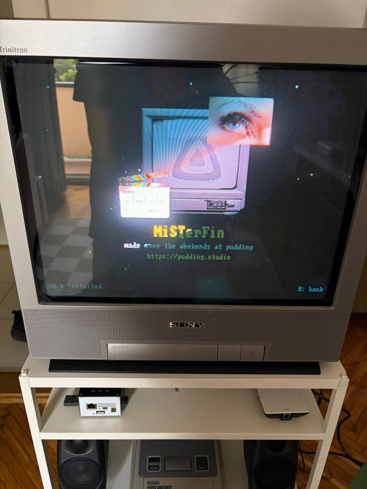
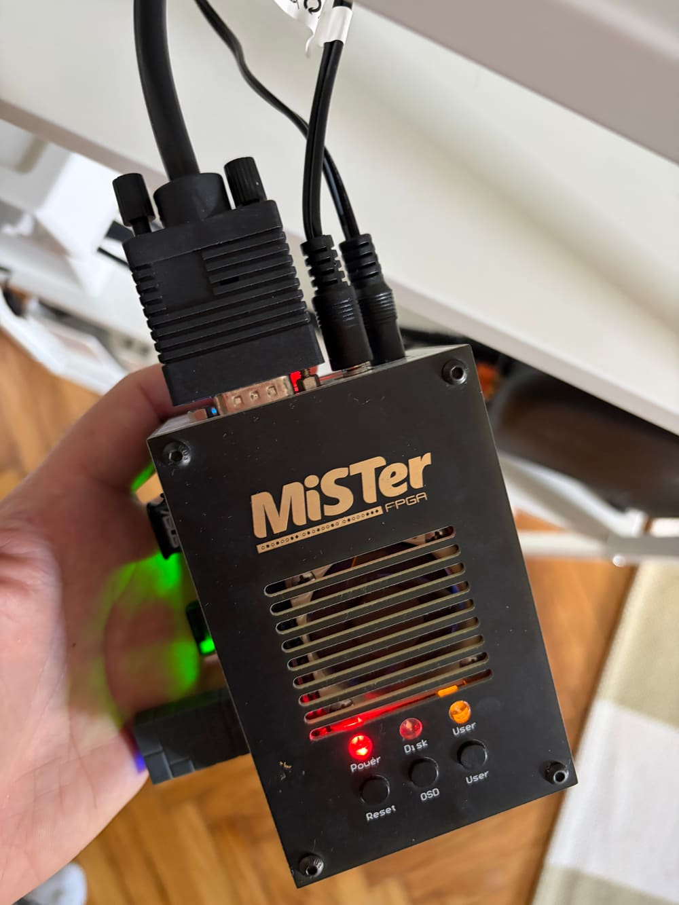
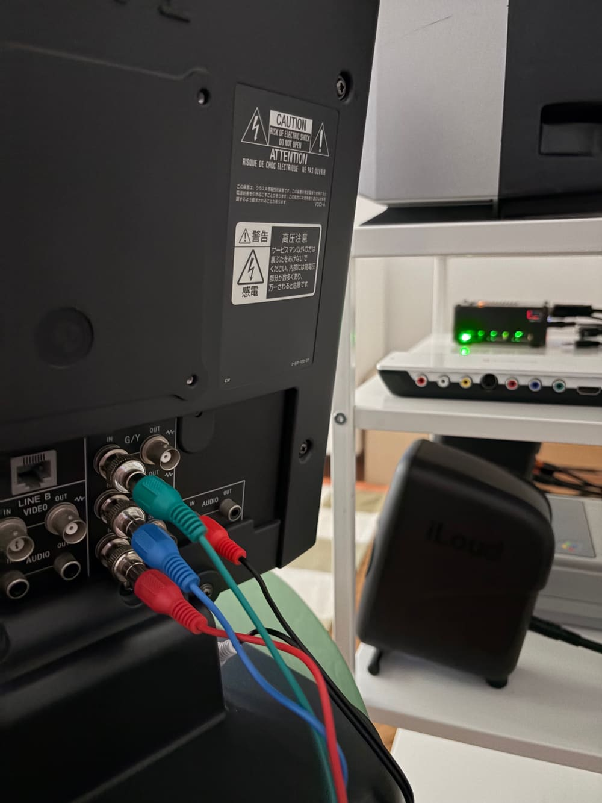
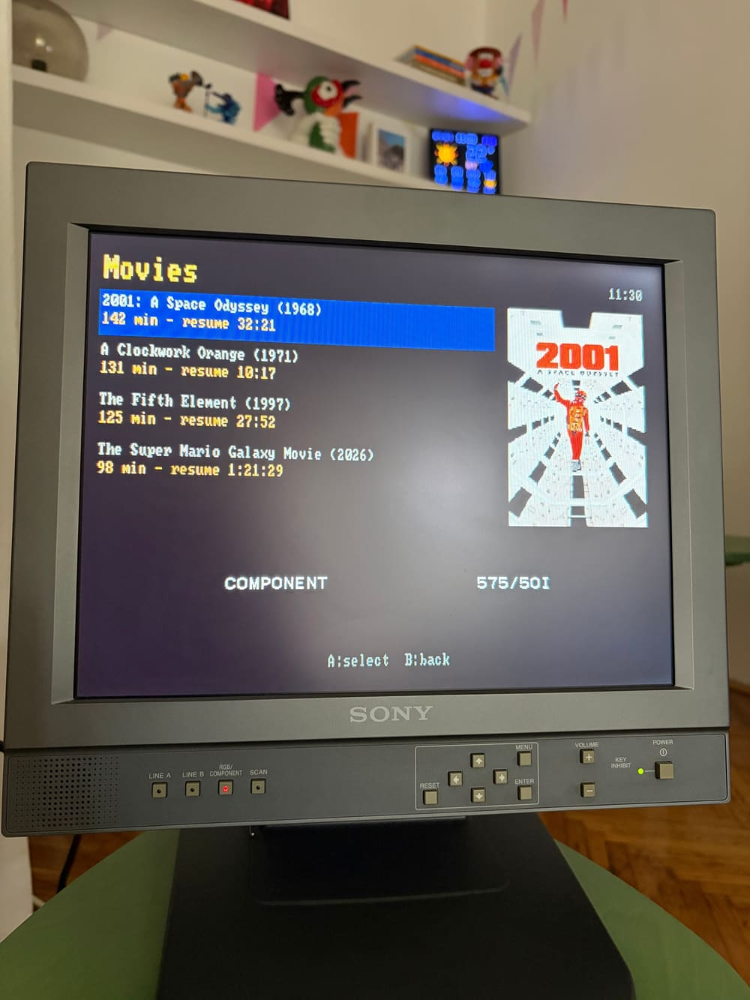
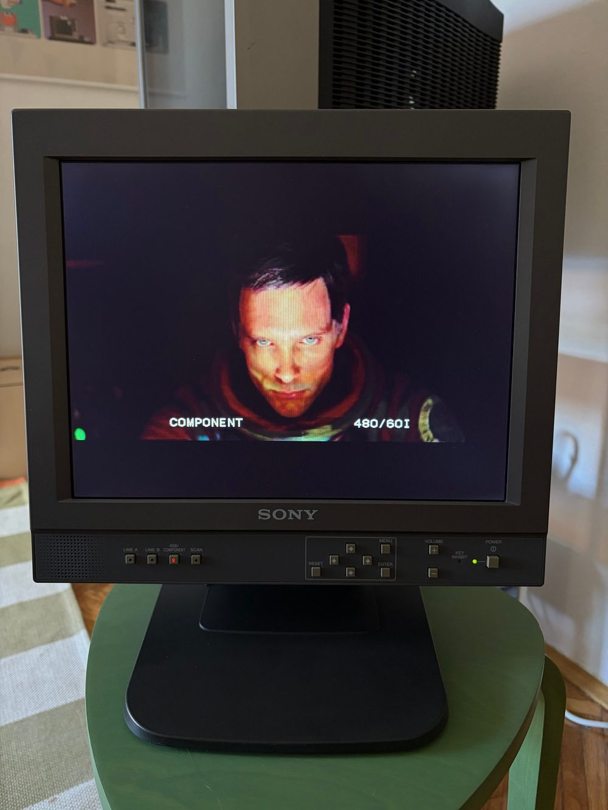
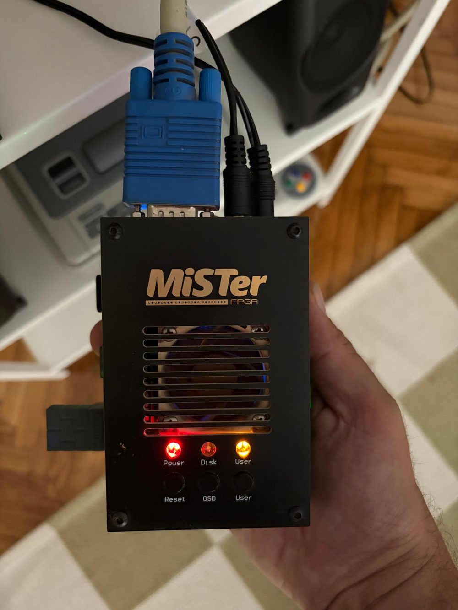
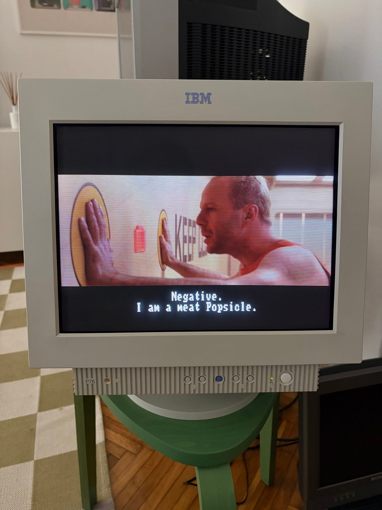
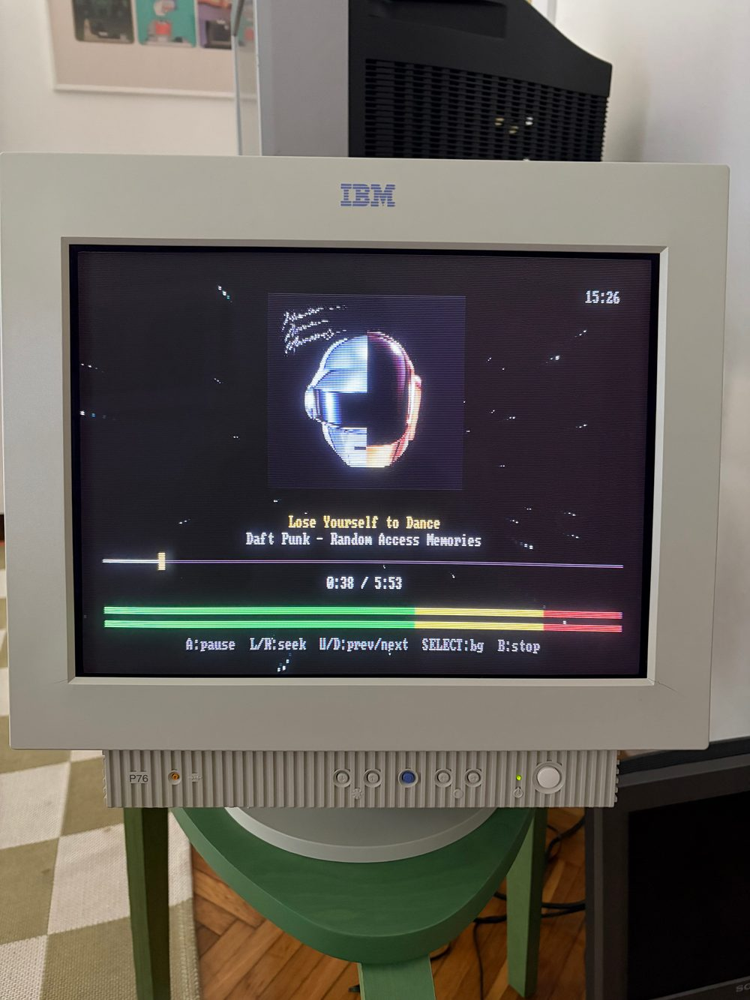

# Display Compatibility

MiSTerFin writes directly to the standard MiSTer framebuffer (`/dev/fb0`) — it doesn't know or care what's physically connected downstream. Whether it actually shows up correctly depends entirely on **MiSTer's own analog/HDMI output configuration** (`MiSTer.ini`) and the exact chain of cables/adapters between the MiSTer and the display. Most "I can't get it on my CRT" reports come down to an `MiSTer.ini` setting or an unsupported adapter combo, not a MiSTerFin bug.

This doc tracks combos we've actually verified, plus the exact `MiSTer.ini` keys that matter for each. **Confirmed = tested on real hardware by us.** Untested combos aren't necessarily broken — we just haven't verified them yet.

**Quick sanity check before anything else:** whatever input mode you select *on the display itself* (RGB vs Component/YPbPr) has to match `ypbpr` in `MiSTer.ini`. Confirmed on real hardware — RGB ini (`ypbpr=0`) + display set to RGB input = correct picture; same RGB ini + display switched to its Component input = solid pink, nothing usable. This is an easy thing to get out of sync (especially on displays that auto-label inputs or default to component) and looks like a much scarier problem than it is.

---

## ✅ Confirmed: Analog I/O board (VGA) → SCART → CRT TV (PAL)

**Chain:** MiSTer main board → official MiSTer Analog I/O board (VGA-style DB15 output) → VGA-to-SCART cable → a classic consumer CRT TV, Sony Trinitron, SCART (RGB) input, PAL.

**Audio:** the VGA-to-SCART cable needs a separate 3.5mm jack input (alongside the VGA connector) to carry audio into the SCART's audio pins — video-only VGA-to-SCART cables exist and won't give you sound.

| Connector on MiSTer | Connector on display | Picture |
|---|---|---|
|  |  |  |

**Relevant `MiSTer.ini` settings:**

```ini
forced_scandoubler=0   ; leave scandoubler as the core/menu default, don't force it
ypbpr=0                ; RGB, not component — this combo is RGB over SCART
composite_sync=1       ; composite sync on the HSync line — what a VGA-to-SCART cable expects
vga_scaler=0           ; VGA port outputs the native/direct signal, not the HDMI scaler's output
```

**Plus this `[Menu]`-scoped override, further down the file — confirmed load-bearing, not optional:**

```ini
[Menu]
vga_scaler=1
video_mode=640,26,60,74,288,0,4,20,12587
```

MiSTerFin (like any MiSTer Script) runs under the "Menu" core context, so this section's `video_mode` is what actually sets the live framebuffer resolution it draws into — confirmed via `fbset -s` on real hardware: **with this section active, `/dev/fb0` is 640x288**; remove/comment it out and the framebuffer falls back to 640x480 instead. We initially assumed this section only affected the HDMI/scaler path and documented it as irrelevant here — that was wrong, verified by directly testing both states on the device. If MiSTerFin looks correctly proportioned on your CRT, this `[Menu]` block (or an equivalent custom video_mode tuned to a similar low interlaced-ish resolution) is very likely why.

`video_mode_pal`/`video_mode_ntsc` (the top-level ones, not `[Menu]`-scoped) are for `vsync_adjust` mode-switching and don't matter for this combo.

**Status:** this is our own daily dev/test setup — confirmed working throughout MiSTerFin's development.

---

## ✅ Confirmed: Analog I/O board (VGA) → Component (YPbPr) → professional monitor (PAL)

**Chain:** MiSTer main board → official MiSTer Analog I/O board (VGA-style DB15 output) → VGA-to-3xRCA component breakout cable → Sony LMD-1410 (professional LCD monitor), component input, PAL.

**Audio:** the VGA-to-component cable needs its own 3.5mm jack input feeding a separate 2xRCA stereo pair (not part of the 3 component video RCAs) — same idea as the SCART combo, just a stereo RCA pair instead of SCART's built-in audio pins.

| Connector on MiSTer | Connector on display | Picture |
|---|---|---|
|  |  |  |

**Relevant `MiSTer.ini` settings:**

```ini
forced_scandoubler=0   ; same as the SCART combo
ypbpr=1                ; component, not RGB
composite_sync=0       ; do NOT force sync onto the HSync line for component — real YPbPr
                        ; expects sync embedded in the Y/luma channel itself. Leaving this at
                        ; the SCART combo's value of 1 (copied over without changing it) was
                        ; the actual bug the first time we tried this: the display synced fine
                        ; (correctly identified the signal as PAL 576i) but rendered everything
                        ; with a strong green cast — a classic symptom of the sync signal
                        ; fighting with the Y channel. composite_sync=0 fixed it completely.
vga_scaler=0            ; same as the SCART combo
```

The same `[Menu]`-scoped override from the SCART combo above (`vga_scaler=1` + the custom `video_mode=640,26,60,74,288,0,4,20,12587` line) applies here too — component output goes through the same Analog I/O board VGA port, same framebuffer resolution story.

**Note:** a *passive* VGA-to-component adapter/cable (no official Analog I/O board) almost certainly won't work at all — see the "does NOT work" entry below. This confirmed combo specifically used the real Analog I/O board, which has the actual DAC hardware to generate true YPbPr levels.

**Status:** confirmed working, including MiSTerFin itself (not just a color-bars-level check) — 2026-07-24.

---

## ✅ Confirmed: Analog I/O board (VGA) → Component (YPbPr) → professional monitor (NTSC)

**Chain:** same hardware as the PAL Component combo above (Sony LMD-1410, component input) — this display supports both 525-line (NTSC) and 625-line (PAL) natively — just switched to NTSC.

| Connector on MiSTer | Connector on display | Picture |
|---|---|---|
|  |  |  |

**Relevant `MiSTer.ini` settings — same `ypbpr`/`composite_sync`/`forced_scandoubler`/`vga_scaler` as the PAL Component combo above**, plus a *different* `[Menu]`-scoped override and one extra top-level key:

```ini
menu_pal=0             ; forces the Menu core itself to NTSC-native (60Hz) — required to match
                        ; the [Menu] video_mode below; leaving this at 1 (PAL) left the Menu core
                        ; generating 50Hz-native video while the scaler output timing below was
                        ; ~60Hz, and the mismatch showed up as a stretched/incorrect picture on
                        ; the stock MiSTer OSD menu itself, not just MiSTerFin.
```

```ini
[Menu]
vga_scaler=1
video_mode=640,26,60,74,240,0,4,18,12587
```

`240` active lines (vs PAL's `288`) and the adjusted vertical timing give a real ~15.73kHz/60.05Hz signal — confirmed correct: the display reports "480/60i", the exact same way the PAL combo's display reports "575/50i" for what's actually 288p. That label is expected, not an error.

**`jellyfin.conf`'s 4th line must be `NTSC`** (not `PAL`) to match — MiSTerFin letterboxes/scales video against whichever one you set there, independent of the ini.

**Known minor cosmetic issue, not yet resolved:** the picture sits slightly off-center on this monitor under this NTSC timing (more empty space top/left than bottom/right) — confirmed present on the stock MiSTer OSD menu too, so it isn't a MiSTerFin bug, and PAL is unaffected on the exact same monitor. Likely needs further `video_mode` porch tuning or a monitor-side geometry adjustment. Doesn't affect usability.

**Status:** confirmed working, including full video playback (a real NTSC-specific mplayer scaling bug was found and fixed along the way — see the repo's commit history) — 2026-07-25.

---

## ✅ Confirmed: Analog I/O board (VGA) → a real multisync VGA CRT monitor, IBM P76 (240p @ 120Hz)

**This is still 240p** — MiSTerFin can't tell this apart from the NTSC Component combo above (same 640×240 framebuffer), it's just reaching a genuine computer VGA monitor instead of a SCART/component-input CRT TV.

**Chain:** MiSTer main board → official MiSTer Analog I/O board (VGA-style DB15 output) → straight VGA cable → IBM P76 (17" multisync CRT computer monitor).

| Connector on MiSTer | Video playback | Music player |
|---|---|---|
|  |  |  |

**Why this needs a different `video_mode` line than the NTSC Component combo:** a genuine multisync *computer* monitor is built for a much higher horizontal sync frequency (commonly ~31.5kHz+) than a 15kHz-range broadcast-video CRT — feeding it the same ~15.7kHz line used for Component/SCART gives "out of scan range", not a picture. The fix (a known trick, not something we invented — see [RetroRGB's writeup](https://retrorgb.com/mister-240p-120hz-on-a-vga-crt-monitor.html)): keep the same 240 *active lines* but double the field rate to 120Hz. Since horizontal frequency = pixel clock ÷ line length, doubling the *effective* rate this way pushes the horizontal frequency up into a real VGA monitor's supported range while the vertical resolution — and everything MiSTerFin actually draws — stays exactly 240p.

**Relevant `MiSTer.ini` settings:**

```ini
forced_scandoubler=0   ; we want genuine 240 lines, not scandoubled up to 480
ypbpr=0                ; RGB
composite_sync=0       ; separate H/V sync, not combined onto HSync — what a real VGA connector expects
menu_pal=0
```

```ini
[Menu]
vga_scaler=1
video_mode=640,240,120
```

That simpler 3-value `video_mode=width,height,Hz` form (rather than the full 9-value custom-timing form used elsewhere in this doc) is a MiSTer shorthand — it computes matching timing automatically. `640,240,120` = 240 active lines, MiSTer picks the rest so the field rate lands at 120Hz.

**Not every multisync VGA monitor will accept this** — it depends on the monitor's actual supported horizontal frequency range. The IBM P76 does; a monitor with a higher minimum horizontal frequency might not.

**`jellyfin.conf`'s 4th line should be `NTSC`** — same reasoning as the Component NTSC combo (this is the same 240p framebuffer).

**Status:** confirmed working, including video and music playback — 2026-07-25.

### PAL variant: 288p @ 100Hz

The same trick has a PAL-side equivalent, and it's confirmed working on the same IBM P76 monitor — same cable, same chain, no new photos needed since it looks basically identical to the 240p shots above. This is essentially a clean, native PAL picture — PVM-style — on an ordinary VGA CRT monitor, and with 288 active lines instead of 240 it has a bit more vertical room to work with than the NTSC/240p variant.

The math carries over directly: 288p at 100Hz (PAL's 50Hz field rate, doubled) lands on the same horizontal sync frequency as regular 576p50, which is exactly the range a multisync VGA CRT already has to support — so any monitor that accepts the 240p/120Hz trick above should accept this one too.

**Relevant `MiSTer.ini` settings** (same idea as the 240p block above, PAL-side):

```ini
forced_scandoubler=0
ypbpr=0
composite_sync=0
menu_pal=1
```

```ini
[Menu]
vga_scaler=1
video_mode=640,288,100
```

**`jellyfin.conf`'s 4th line should be `PAL`** — this is the normal 288-line framebuffer, same as the SCART/Component PAL combos above.

**One caveat worth knowing:** at 100Hz, 50fps PAL content can show a faint "double image" effect in fast motion (the same tradeoff the 240p/120Hz trick has with 60fps content at 120Hz, just a bit more noticeable since PAL's native rate is lower) — not something MiSTerFin can do anything about, it's inherent to the doubled-refresh trick itself.

**Status:** confirmed working — 2026-07-26.

---

## Experimental: true interlaced output (576i/480i) on a CRT TV

Everything above scans out progressively — 288 (PAL) or 240 (NTSC) lines, each drawn every field, which gives the classic scanline look. A CRT TV was actually built for **interlaced** video: two half-line-offset fields alternating, filling all 625/525 raster lines. For film and TV content that's visibly smoother and "fuller" — no scanline gaps, broadcast-style motion — and side by side we found it clearly nicer to watch movies on.

MiSTer's stock scaler can't do this today. Izzie Walton (@iwalton3) wrote a patch for the MiSTer core that adds it — see the [tracking issue](https://github.com/puddingstudio/MiSTerFin/issues/11) — and it works with MiSTerFin unmodified: the framebuffer stays the normal 640x288/640x240, the scaler turns it into a proper interlaced signal at scanout.

**Confirmed working** on the Analog I/O board over **both SCART and Component**, in **both PAL and NTSC**, on the setups this doc's confirmed combos above describe — 2026-07-27. (The patch author verified it over `direct_video` HDMI; the analog paths were confirmed here.)

### What's involved (read before doing it)

This is **not** a MiSTerFin setting — it replaces two system-wide files on your SD card (`MiSTer`, the main system binary, and `menu.rbf`, the menu core) with patched builds from a fork. That affects your whole MiSTer, not just MiSTerFin, and it is experimental. Two things to accept up front:

- **A MiSTer system update will overwrite the patched files** (update_all / Downloader replaces `MiSTer` and `menu.rbf` with official builds), silently turning interlace back off. Re-apply the steps after updating, or skip those items in your updater config.
- **Keep the backups.** If anything goes wrong you'll want to restore the stock files from the SD card on another machine.

### Steps

1. **Back up the stock files** (SSH into the MiSTer, or do the equivalent with the SD card in a PC):
   ```sh
   mkdir -p /media/fat/interlace-backup
   cp /media/fat/MiSTer /media/fat/interlace-backup/MiSTer.stock
   cp /media/fat/menu.rbf /media/fat/interlace-backup/menu.rbf.stock
   cp /media/fat/MiSTer.ini /media/fat/interlace-backup/MiSTer.ini.bak
   ```
2. **Get the patched files** from [iwalton3's test release](https://github.com/iwalton3/MiSTerFin/releases/tag/v0.0.1) (`MiSTer` and `menu.rbf`; source for both is public — [Main_MiSTer](https://github.com/iwalton3/Main_MiSTer/tree/direct-video-interlace) and [Menu_MiSTer](https://github.com/iwalton3/Menu_MiSTer/tree/direct-video-interlace), branch `direct-video-interlace`).
3. **Install them.** The running `MiSTer` binary can't be overwritten in place — copy to a temporary name first, then move over it:
   ```sh
   # copy the downloaded files to the SD card, then:
   mv /media/fat/MiSTer.new /media/fat/MiSTer && chmod +x /media/fat/MiSTer
   cp menu.rbf /media/fat/menu.rbf
   ```
4. **Enable it in `MiSTer.ini`** — add one line under `[Menu]`, next to the `vga_scaler=1` your analog combo already uses:
   ```ini
   [Menu]
   vga_scaler=1
   direct_video_interlace=1
   video_mode=640,26,60,74,288,0,4,20,12587
   ```
   **Leave your `video_mode` exactly as it was.** The scaler doubles the field-sized mode into the full interlaced frame by itself — doubling the line count in `video_mode` yourself produces a huge, flickering picture (confirmed the hard way).
5. **Reboot.** MiSTerFin needs no configuration changes at all — the default transcode profile already carries full PAL/NTSC source detail.

### Restoring stock

```sh
cp /media/fat/interlace-backup/MiSTer.stock /media/fat/MiSTer.new
mv /media/fat/MiSTer.new /media/fat/MiSTer && chmod +x /media/fat/MiSTer
cp /media/fat/interlace-backup/menu.rbf.stock /media/fat/menu.rbf
```
Then remove the `direct_video_interlace=1` line from `MiSTer.ini` and reboot.

### Notes

- Static UI elements (menu text, thin horizontal edges) show the slight interline flicker inherent to interlaced video — that's physics, not a bug. Film/TV content is where this mode shines.
- MiSTerFin versions before v0.9.5 could show stretched or corrupted video with this mode when the transcode profile was raised — fixed in v0.9.5 (aspect-exact letterboxing for any profile, and DVD-format sources are always freshly transcoded). Use v0.9.5 or later.
- The long-term goal is getting this upstreamed into the official MiSTer core so it becomes a plain ini option — progress is tracked in [issue #11](https://github.com/puddingstudio/MiSTerFin/issues/11).

---

## Untested / reported problem combos

*(to fill in as we verify or get reports)*

- HDMI direct to a modern TV/monitor
- HDMI → Blackmagic-style capture card (see the aspect-ratio caveat below — MiSTer stretches a Script's framebuffer to fill the target `video_mode` canvas with no aspect correction, unlike FPGA cores)
- Component (YPbPr) via a passive VGA-to-component adapter, i.e. **without** the official Analog I/O board (**likely does NOT work** — these adapters just rewire pins, they don't do the RGB→YPbPr color-space conversion; confirmed this produces "no sync" on at least one display we tried)
- NTSC over SCART/RGB (NTSC is only confirmed over Component so far — see above)
- Direct Video Adapter (HDMI-to-VGA DAC) for VGA/component output
